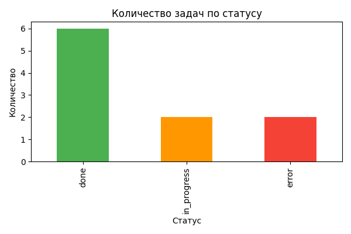
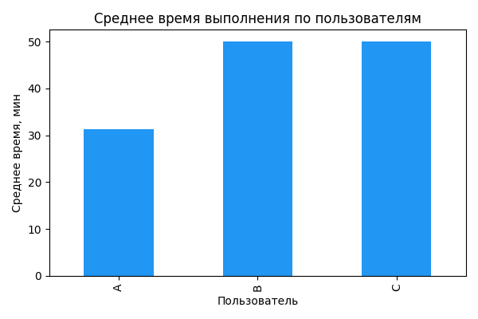
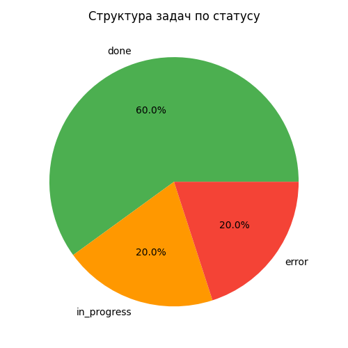

# Data Analysis Automation — Task Statistics

## Описание проекта
Скрипт `statistics.py` выполняет автоматический анализ данных о задачах и исполнителях.  
Он вычисляет статистику по статусам, среднее и суммарное время по пользователям, сохраняет результаты в виде таблиц (CSV) и графиков (PNG), готовых для анализа и визуализации в Excel или Power BI.

***

## Основные возможности
- Подсчёт количества и процента задач по статусам (`done`, `in_progress`, `error`).
- Расчёт среднего и суммарного времени выполнения задач каждым пользователем.
- Определение исполнителя с наибольшим суммарным временем работы.
- Автоматическое создание файлов:
  - Таблицы (CSV);
  - Графики (PNG).

***

## Используемые технологии
- **Python 3.12+**
- **pandas** — анализ табличных данных  
- **matplotlib** — создание визуализаций  
- **GitHub Codespaces / VS Code** — среда разработки  
- **Excel** — анализ данных

***

## Как запустить

1. Установи зависимости:
   ```bash
   python3 -m pip install --user pandas matplotlib
   ```

2. Запусти:
   ```bash
   python3 statistics.py
   ```

3. Скрипт создаст файлы:
   ```
   1_status_table.csv
   2_avg_all.csv
   3_avg_done.csv
   4_total_per_user.csv
   status_distribution.png
   avg_time_per_user.png
   status_pie.png
   ```

***

## Визуализация

### Распределение задач по статусам


### Среднее время выполнения по пользователям


### Структура задач по статусам


***

## Импорт в Excel
- Открой созданные `.csv` файлы с помощью **Файл → Открыть → Обзор**.
- Если всё отображается в одной колонке — используй **Данные → Текст по столбцам**, разделитель «запятая».

***

## Пример результата
```
Исполнитель с самым большим суммарным временем: B – 150 минут
```

***

## Автор
Разработано в рамках практической задачи по автоматизации анализа данных с использованием Python и Pandas.  
Автор: *SunnyS8*

